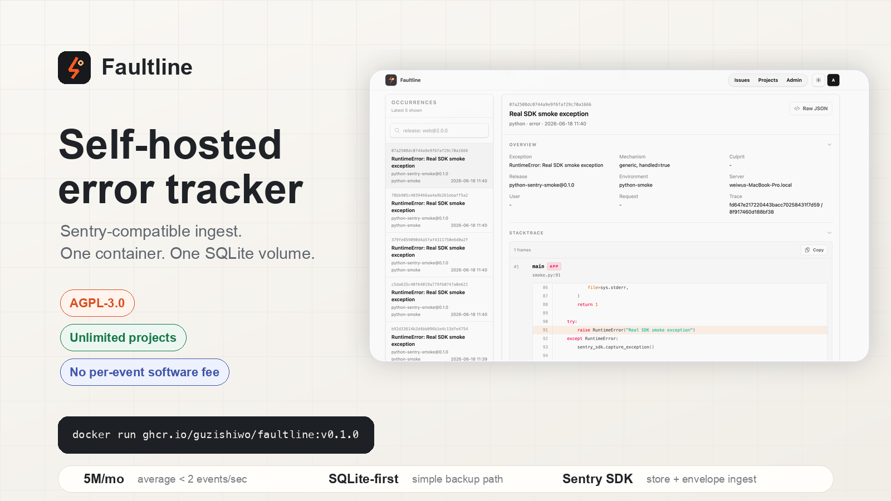

# Faultline 中文说明

[English README](../README.md)



Faultline 是一个轻量级自托管错误追踪系统，基于 Phoenix、LiveView 和
SQLite 构建。它适合想复用 Sentry SDK 上报能力，但不想维护 PostgreSQL、
Redis、Kafka、ClickHouse 或对象存储的小团队。

> 当前状态：早期 V1.0。目标是做一个实用的单节点开源版本，不是完整替代
> Sentry。
>
> 许可证：GNU AGPL v3.0 only。

## 为什么做 Faultline

很多小团队其实不需要一整套可观测性平台。他们最急的问题通常只有一个：
“线上哪里炸了，怎么尽快定位和修掉？”

Sentry 很强，但自托管 Sentry 是一个大型分布式系统。GlitchTip 覆盖更广，除了错误追踪，
还做 performance monitoring、uptime monitoring 和 logs。

Faultline 想做的是更窄、更直接的一件事：让 Sentry 兼容的错误追踪像普通应用一样容易理解、
容易部署、容易备份、容易维护。开源 V1.0 会坚持单节点、SQLite-first，优先把日常 issue
分诊工作流做好，而不是把自己扩成另一套大型监控平台。

范围刻意收得很小：

- 上报路径要简单：接收常见 Sentry SDK payload，本地持久化。
- 运维路径要简单：一个 Phoenix release，一个 SQLite 数据库，一个持久化 `/data` 卷。
- UI 要直接：快速扫 issue、看清事件详情、能搜索、能做保留策略、能配置告警，不要绕进复杂后台。
- 代码要好维护：Phoenix contexts、LiveView 页面、Ecto schema，少量清晰的活动部件。

## 它能做什么

- 接收 Sentry SDK 的事件上报，支持兼容的 store/envelope 接口。
- 使用 SQLite 存储原始事件、标准化事件和聚合后的 issue。
- 提供 LiveView 控制台，用于 issue 分诊、事件查看、搜索、保留策略和告警配置。
- 部署保持简单：一个容器，加一个持久化 `/data` 卷。
- 支持结构化搜索，例如 `release:1.2.3`、`environment:prod`、
  `status:unresolved`。

## 它不是什么

- 不是完整的 Sentry API 实现。
- 不是完整可观测性平台。
- 暂不支持 session replay、profiling、metrics、APM、source maps、minidumps。
- 开源 V1.0 不以多节点 SaaS 架构为目标。

## 和 GlitchTip、Sentry 的对比

Faultline 不是要照搬现有 Sentry 替代品的所有功能，而是选择另一组取舍。

| 项目 | 更适合谁 | 取舍 |
| --- | --- | --- |
| [GlitchTip](https://glitchtip.com/documentation/) | 想要开源错误追踪，同时还要 performance monitoring、uptime monitoring、logs、托管版本和更完整平台能力的团队。 | 功能面更广，也意味着概念、配置和维护面更多。Faultline V1.0 刻意不追这个宽度。 |
| [Sentry](https://sentry.io/) | 想要最成熟的托管可观测性产品、广泛 SDK 支持、tracing、replay、profiling、集成和企业级控制的团队。 | 产品能力最完整，但托管价格会随用量增长；自托管则是大型分布式系统。 |
| Faultline | 想要尽量轻、能用一个容器加 SQLite 跑起来的 Sentry 兼容 issue tracker 的小团队。 | 范围更窄：error tracking first、single-node first，不宣称完整兼容 Sentry API。 |

### 每月 20 万 errors 的价格

下面是每月 200,000 条 error events 的粗略月费对比，使用 2026 年 6 月查看到的公开价格。
这里只比较错误事件量，不包含税费、备份、存储增长、值班时间、traces、replays、logs、
attachments、uptime checks 或付费支持。

| 方案 | 预估月费 | 价格含义 |
| --- | ---: | --- |
| Faultline 自托管 | 约 $5-$20 基础设施 | 一个容器加一个持久化 SQLite 卷。软件本身不按事件收费。 |
| [GlitchTip 托管版](https://glitchtip.com/pricing/) | $50 | 500k events/月的 Medium 档覆盖 20 万 errors。 |
| [Sentry Team](https://sentry.io/pricing/) | 约 $58-$66 | Team 默认包含 50k errors/月，剩余 150k 按 Sentry 公布的 errors 价格计费。 |

这个量级下，差异不只是原始 ingest 成本。Sentry 买到的是最成熟的托管产品面。
GlitchTip 买到的是更宽的托管开源风格平台。Faultline 则把运维形态压到最小：
一个 Phoenix 应用、一个 SQLite 数据库，以及更窄的错误追踪功能面。

Faultline 的成本模型刻意保持平坦：不按项目数收费，也没有按事件数收取的软件费用。
你可以添加机器能承受的任意数量项目。事件量越大，单位成本通常越低，因为账单主要来自
服务器、磁盘、备份，以及你投入的运维时间。

### UI

Faultline 的 UI 使用 Phoenix LiveView，不需要维护单独的 SPA。界面是服务端渲染、实时更新，
并且离业务代码很近。这里更在意日常排查时顺不顺手，而不是做一个花哨的 dashboard：

- issue 列表密度更高，适合快速扫大量错误。
- issue 详情页把 stacktrace、breadcrumbs、tags、request、user、release、environment 放在同一个排查流程里。
- 项目设置、用量、保留策略、告警规则都放在和工作流接近的位置。
- 使用 Tailwind 做克制、清楚、响应式的界面，不额外引入一套前端应用。

目标很朴素：打开 issue，看懂错误，判断是修复、忽略还是配置告警。这个路径越短越好。

### 性能

Faultline 面向的是一个很常见的中间地带：用量计费的 SaaS 会开始变贵，但这点错误量对一台配置合适的机器来说并不难。
每月 500 万条 error events，平均下来不到每秒 2 条。对这个架构来说，这应该是轻松的。

真正难的不是月总量，而是峰值、payload 大小、保留策略、搜索和备份。一次坏发布可能在几分钟内打进平时一个月的量。
大的 stacktrace、breadcrumbs、request data 和 tags 会让事件数不高时 SQLite 文件也变大。
保留几百万条事件本身是合理的；让这些事件在错误峰值时依然可搜索、可备份、成本可控，才是真正的工程问题。

几个关键取舍：

- Phoenix 和 Bandit 在一个 BEAM 应用里处理并发 HTTP ingest。
- SQLite 让 V1.0 默认存储在本机完成，少一次数据库网络跳转。
- 标准化事件字段和 issue search document 让常见 UI 查询不需要反复解析 raw JSON。
- LiveView 避免为控制台维护一个大型独立前端应用。
- 保留策略、限流和 drop rules 是产品的一部分，避免 noisy project 变成突发运维成本。

所以 Faultline 关心的 benchmark 很实际：一个小团队能不能在一台普通服务器上保留自己关心的错误，
同时不让每次流量峰值都变成账单峰值或运维事故。

### 维护

Faultline 默认面向自己部署、自己维护的人：

- V1.0 默认路径不需要 PostgreSQL、Redis、Kafka、ClickHouse、对象存储、Celery 或单独 worker 集群。
- 一个数据库文件就能备份。
- 一个容器就能部署或回滚。
- release 启动时执行迁移，并支持初始化第一个管理员。
- 核心数据模型很小：projects、DSNs、raw events、normalized events、grouped issues、alert rules、retention rules、users。

维护面小，就是选择 Faultline 的主要理由。

## 架构

```text
Sentry SDK
  -> Faultline Phoenix 应用
  -> SQLite 数据库 /data/faultline.db
  -> LiveView issue 分诊界面
```

事件上报路径使用普通 Phoenix HTTP controller。LiveView 只用于人工操作的控制台。

## 本地启动

安装依赖并准备本地数据库：

```sh
mix setup
```

启动 Phoenix：

```sh
mix phx.server
```

打开：

```text
http://localhost:4010
```

也可以用 IEx 启动：

```sh
iex -S mix phx.server
```

## Docker 部署

使用发布镜像和持久化 SQLite 卷运行：

```sh
docker run --pull always -d --name faultline --restart unless-stopped -p 4010:4010 -v faultline-data:/data -e PHX_HOST=localhost ghcr.io/guzishiwo/faultline:v0.1.0
```

打开：

```text
http://localhost:4010
```

默认第一个管理员邮箱：

```text
admin@faultline.local
```

查看自动生成的第一个管理员密码：

```sh
docker exec faultline cat /data/bootstrap_admin_password
```

Docker 命名卷 `faultline-data` 会保存 SQLite 数据库和自动生成的 Phoenix secret：

```text
/data/faultline.db
/data/secret_key_base
```

构建并运行本地镜像：

```sh
docker build -t faultline .

docker run -p 4010:4010 \
  -v faultline-data:/data \
  -e PHX_HOST=localhost \
  faultline
```

`PHX_HOST` 应该填写浏览器和 SDK 能访问到的公网 HTTPS 域名。这里只填 host，不要带
`https://`。本地 Docker 运行使用 `localhost`，生产环境使用真实域名。

正确：

```text
PHX_HOST=errors.example.com
```

错误：

```text
PHX_HOST=https://errors.example.com
```

生产数据默认存放在：

```text
/data/faultline.db
```

部署时一定要把 `/data` 挂到持久化存储。如果没有设置 `SECRET_KEY_BASE`，容器会自动生成一个，
并保存到 `/data/secret_key_base`，所以只要保留这个卷，重启后 cookie 仍然有效。

## Railway 部署

这个仓库自带 Dockerfile，可以直接用 Railway 从 GitHub 仓库部署。

推荐 Railway 变量：

```env
PORT=4010
PHX_HOST=${{RAILWAY_PUBLIC_DOMAIN}}
SECRET_KEY_BASE=<mix phx.gen.secret 的输出>
LANG=en_US.UTF-8
LC_CTYPE=en_US.UTF-8
FAULTLINE_ADMIN_EMAIL=admin@example.com
FAULTLINE_ADMIN_PASSWORD=<临时强密码>
```

同时在 Railway 创建 Volume，并挂载到：

```text
/data
```

注意：

- 不要在 Dockerfile 里写 `VOLUME`。Railway 要在 UI 里配置 Volume。
- `PHX_HOST` 用于 Phoenix LiveView 的 origin check。没设置 `PHX_HOST` 时，
  Faultline 会尝试使用 Railway 提供的 `RAILWAY_PUBLIC_DOMAIN`。
- 应用启动时会自动执行数据库迁移，并初始化第一个管理员。
- 如果 Railway 部署在新加坡，而你在中国大陆访问，LiveView 后台操作可能会有明显延迟。
  这是网络 RTT 导致的，不是页面本身崩了。

## 第一个管理员

容器启动时会执行：

```text
Faultline.Release.bootstrap_admin_from_env()
```

如果数据库里还没有用户，会创建第一个管理员。

推荐生产变量：

```env
FAULTLINE_ADMIN_EMAIL=admin@example.com
FAULTLINE_ADMIN_PASSWORD=<临时强密码>
```

如果没有提供密码，Faultline 会生成一个密码并写入：

```text
/data/bootstrap_admin_password
```

## Sentry SDK 接口

Faultline 优先支持 SDK 事件上报：

```text
POST /api/:project_id/envelope/
POST /api/:project_id/store/
```

## 许可证

Faultline 使用 GNU Affero General Public License v3.0 only（`AGPL-3.0-only`）。
如果你修改了 Faultline，并通过网络让用户使用这个修改版服务，AGPL 要求你向这些用户提供对应的修改版源码。

当前重点支持：

- Events 和 messages。
- Exceptions 和 stacktraces。
- Breadcrumbs。
- Tags、user、request、release、environment、server name。
- 自定义 fingerprint。
- 未识别的 envelope item 可以接收并忽略。

暂缓支持：

- Source maps。
- Minidumps。
- Performance transactions。
- Session replay。
- Profiling。
- Metrics。

## 搜索

示例：

```text
TypeError
release:1.2.3
environment:prod
project:cai-label
project:"Cai Label"
status:unresolved
level:error checkout
release:1.2.3 environment:prod TypeError
```

规则：

- 普通文本会搜索 issue search document。
- `key:value` 会走结构化过滤。
- `project:` 可以匹配项目 id、slug 或名称。
- `status:` 用来过滤 issue 状态。
- 其他 key 会匹配 issue 结构化字段或标准化后的 SDK tags。

## 开发

常用命令：

```sh
mix setup
mix phx.server
mix test
mix precommit
```

提交改动前建议跑：

```sh
mix precommit
```

## 更多文档

- [单节点部署](SINGLE_NODE_DEPLOYMENT.md)
- [SQLite 存储方案](SQLITE3.md)
- [Fly.io 部署](FLY_IO_DEPLOYMENT.md)
- [Roadmap](ROADMAP.md)
- [用户和管理员任务](USER_ADMIN_TASKS.md)
